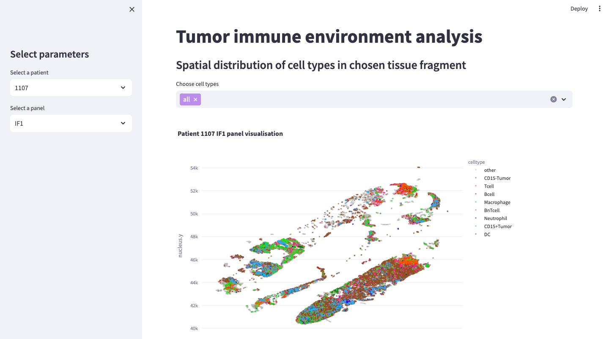

# Analiza TLS w próbkach biopsji nowotworów

## Opis projektu

Ten projekt skupia się na analizie i wizualizacji TLS -- trzeciorzędowych struktur limfatycznych (ang. tertiary lymphoid structures), które są obecne w próbkach biopsji od pacjentów z nowotworami. Wyniki przedstawione są w aplikacji Streamlit, w której użytkownik może wybrać konkretnego pacjenta i zobaczyć wizualizację fragmentu jego tkanki, z zaznaczonymi różnymi typami komórek, oraz wizualizację zidentyfikowanych u niego kandydatów na struktury TLS. Aplikacja oferuje dodatkowo różne statystyki dotyczące TLS danego pacjenta, a także zbiorczych danych zebranych od wszystkich badanych pacjentów, dzięki czemu możliwe jest porównywanie wyników i lepsze zrozumienie kontekstu badań oraz natury i różnorodności struktur TLS.



## Struktura projektu

Projekt składa się z trzech głównych skryptów: 

* `main.py`: Zbiera i analizuje dane dotyczące liczby i składu TLS u wszystkich pacjentów i zapisuje je do pliku, aby umożliwić łatwy dostęp do danych.
* `patient_statistics.py`: Zajmuje się wizualizacją danych od poszczególnych pacjentów.
* `app.py`: Zbiera wyniki całego projektu i prezentuje je w aplikacji Streamlit.

## Wymagania

Wszystkie wymagane pakiety zapisane są w pliku ```requirements.txt``` (możesz zainstalować je komendą ```pip install requirements.txt```).

## Jak uruchomić

Projekt może zostać uruchomiony następującą komendą:
```streamlit run app.py```